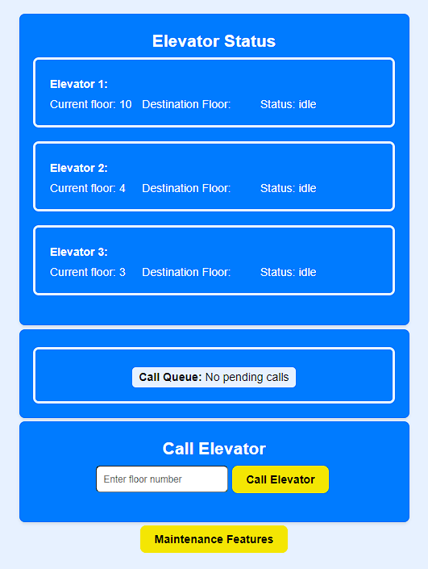

# 🛗 Elevator-App-MongoDb

## Table of Contents

- [Project Overview](#project-overview)
- [Installation and Setup](#installation-and-setup)
- [Project Features](#project-features)
- [Project Structure](#project-structure)
- [Technologies Used](#technologies-used)

## Project Overview

**Project Name:** ElevatorApp  
**Description:** ElevatorApp is a Node.js application for managing a network of elevators. This version uses MongoDB with Mongoose for data storage and management. It provides API endpoints for calling elevators to specific floors, checking elevator availability, and tracking elevator status.  The frontend, built with React, fully interacts with the functionalities of the backend.

## Installation and Setup

### Requirements:

- Node.js
- npm (Node Package Manager)
- MongoDB

### Installation:

### Installing MongoDB Community Server and MongoDB Compass

To run this project, you need to install MongoDB, which is used as the primary database, and MongoDB Compass, which is an optional GUI that helps manage your MongoDB databases.

1. Download and install the **MongoDB Community Server** from the [MongoDB Download Center](https://www.mongodb.com/try/download/community). Choose the version that is compatible with your operating system. This server is where your MongoDB databases will reside.

2. During the installation, you'll also have the option to install **MongoDB Compass**. Install it if you prefer a graphical interface to manage your databases.

After installation, the application will connect to MongoDB using a URI defined in your environment variables. Ensure that you have a `.env` file in your project root with the `MONGODB_URI` variable set to your MongoDB connection string, such as:

```env
MONGODB_URI=mongodb://localhost:27017/elevatorSystem
```

1. **Clone the Repository:**
   ```bash
   git clone https://github.com/PhilHacks/Elevator-App-MongoDb.git
   ```
2. **Navigate to the Project Directory:**
   ```bash
   cd Elevator-App-MongoDb
   ```
3. **Install the Required Dependencies:**
   ```bash
   npm install
   ```
4. **Start the Server:**
   ```bash
   npm start
   ```
   The ElevatorApp server will now be running, and you can access it at `http://localhost:3000` in your web browser or postman.

## Project Features

This application offers several API endpoints for managing and tracking elevators:

- **Call Elevator:**
  - **Endpoint:** `/callElevator`
  - **Method:** POST
  - **Description:** Request an elevator to a specified floor. Include the desired floor in the request body as `{ "floor": number }`.
- **Elevator Status:**
  - **Endpoint:** `/elevator/status`
  - **Method:** GET
  - **Description:** Get the status of all elevators, including their current floor and availability.
- **Check Elevator Availability:**
  - **Endpoint:** `/elevator/available/:elevatorId`
  - **Method:** GET
  - **Description:** Check if a specific elevator is available by providing the elevator ID in the URL.

## Project Structure

#### Backend

```
backend/
├── src/
│   ├── crudOperations.js  
│   ├── dbConnect.js       
│   ├── elevatorManager.js 
│   ├── elevatorModel.js   
│   └── routes.js         
├── main.js                

```

#### Frontend

```
frontend/
├── src/
│   ├── components/
│   │   ├── CallElevator.jsx
│   │   ├── CallQueue.jsx
│   │   ├── ElevatorStatus.jsx
│   │   └── UpdateStatus.jsx
│   ├── services/
│   │   └── ElevatorServices.js
│   ├── App.css
│   ├── App.js
│   ├── App.test.js
│   ├── index.css
│   └── index.js
├── .gitignore
├── README.md
├── package-lock.json
└── package.json
```

## Image of Elevator App



## Technologies Used
- Backend: Node.js, Express.js, MongoDB (Mongoose)
- Frontend: React, Axios, Styled-Components.

